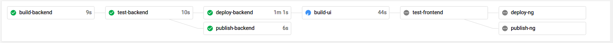

# Angular + Flask + CircleCI + Heroku

[](https://circleci.com/gh/realpacific/fullstack-cicd-automation)

This project demonstrates:
* Angular Library
* NgRx
* Flask
* Reactive vs Template-driven forms
* Chat implementation using flask-socketio & Chatbot
* Cypress
* CircleCI + Automated DockerHub publish & Heroku Deployment


### What is the purpose of this project?
This project is where I put all the things I want to try out/learn. So this project has no real world purpose. Currently, 
this project demonstrates backend + frontend + CI/CD. The CI/CD is for CircleCI but uses no CircleCI specific orbs. Hence,
except for the schema, the build/test/deploy scripts should hopefully be platform agnostic.



---
### Deployment URLs

(These are deployed at Heroku so might require a few seconds for backend to start responding to the requests.)

* [Backend](https://prashant-flask-app.herokuapp.com)
* [Frontend](https://prashant-ng-app.herokuapp.com)


---
### Installing ngrx libraries:

```bash
npm install @ngrx/core @ngrx/effects @ngrx/store @ngrx/store-devtools ngrx-store-freeze
```

### Setting up custom library

```bash
ng new <application-name> --create-application=false
ng generate library <library-name> --prefix=rpa
ng generate application <application-name>
ng build <library-name> --watch
```

### Packaging custom library

To create compressed file for publishing:

```bash
ng build <library-name>
cd dist/<library-name>
npm pack
npm publish --registry=http://localhost:4873
```

### Publishing & Installing custom library

This project uses **dope-table** library which firstly needs to be published locally in Verdaccio. For this, run Verdaccio & point `npm` to that registry:

```bash
docker run -it --rm --name verdaccio -p 4873:4873 verdaccio/verdaccio
npm adduser --registry http://localhost:4873
cd <location-of-compressed-files>
npm publish --registry=http://localhost:4873
npm install dope-table --registry=http://localhost:4873
```

### Starting Flask Backend

```bash
cd backend
python3 -m venv ./venv
source venv/bin/activate
pip3 install -r requrements.txt
python3 app.py
```

### Endpoints
```
GET /companies/reload
GET /companies
GET /companies/<id>
DELETE /companies/<id>
POST /companies -d {name: <company_name>}
```

### CircleCI Local Installation
```bash
sudo snap install circleci
sudo snap install docker
sudo snap connect circleci:docker docker
export GITHUB_TOKEN=your-token-here
circleci setup
circleci local execute
```

___
## References
* [The Angular Library Series - Creating a Library with Angular CLI](https://medium.com/angular-in-depth/creating-a-library-in-angular-6-87799552e7e5)
* [Angular Workspace: No Application for You!](https://medium.com/angular-in-depth/angular-workspace-no-application-for-you-4b451afcc2ba)
* [NgRx Official Site](https://ngrx.io/guide/store)
* [NgRx: Action Creators redesigned](https://medium.com/angular-in-depth/ngrx-action-creators-redesigned-d396960e46da)
* [Chatbot (used as git submodules)](https://github.com/ahmadfaizalbh/Chatbot)
* [How to get started with Cypress](https://medium.com/angular-in-depth/get-started-with-cypress-d6ac4b910605)
* [How to build a CI/CD pipeline with Docker](https://circleci.com/blog/continuous-deployment-with-circleci-orbs-automate-deploys-to-aws-gcp-k8s-and-more/)
* [Container Registry & Runtime (Docker Deploys)](https://devcenter.heroku.com/articles/container-registry-and-runtime)
* [Running NGINX on Heroku with Docker](https://ntotten.com/2018/07/22/nginx-on-heroku/)
